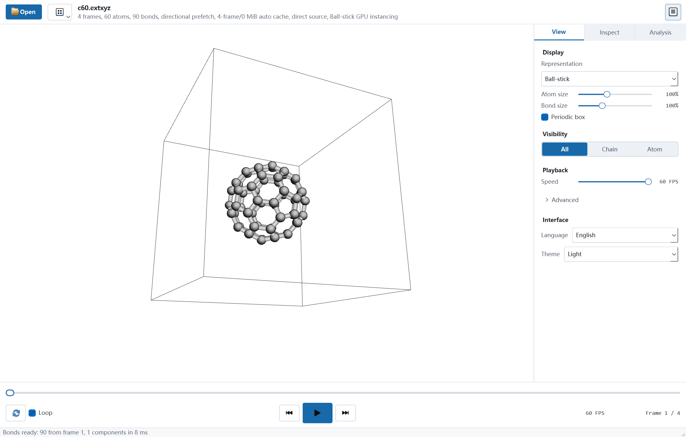
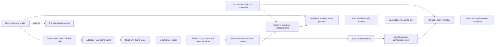

# TrajPlayer

[](https://github.com/luosj1212/TrajPlayer/actions/workflows/ci.yml)
[](LICENSE)
[](#requirements)

A GPU-first desktop viewer for responsive playback and scrubbing of large
molecular dynamics trajectories.



TrajPlayer focuses on one job: opening local ASE and Gromacs trajectories
quickly and playing them smoothly with bounded memory use. It is a lightweight
viewer designed to work alongside the wider molecular-visualization ecosystem.

> **Alpha release:** file compatibility and cache metadata may still change.
> Keep the original trajectory files.

## Why TrajPlayer

TrajPlayer began with a practical frustration from machine-learning potential
development. ASE `.traj` files fit naturally into simulation and training
workflows, but quickly inspecting a long trajectory, moving to a distant frame,
or scrubbing through it interactively was often less convenient than producing
the trajectory in the first place.

The first working prototype was built with the assistance of OpenAI Codex. It
was then iteratively profiled, tested, and reworked around a narrow goal: open an
ASE trajectory directly, show the first useful frame quickly, and keep playback
responsive without loading the whole trajectory into RAM.

Gromacs became another frequent part of the same workflow, so support was
extended to GRO structures and XTC/TRR trajectories. The project remains
focused on fast local inspection, while analysis and publication workflows can
continue in the specialized tools users already prefer.

## Highlights

- OpenGL instanced atoms and bonds with no per-atom CPU drawing loop
- Direct random-access readers for ASE `.traj`, XYZ/extXYZ, GRO, PDB, CIF,
  XTC, and TRR
- Native common-case XYZ/extXYZ parsing directly into the streamer's contiguous
  float32 frame slab, with a Python fallback for unusual layouts
- Progressive XYZ indexing: frame 1 opens before the full file scan finishes
- Background streaming, direction-aware prefetch, and a unified 64-256 MiB
  memory budget with I/O latency and cache-hit telemetry
- Frame leases that upload contiguous float32 positions without a second
  renderer-side full-frame copy
- Live slider scrubbing without waiting for mouse release
- Sequential 1-60 FPS playback with no trajectory-frame skipping
- Ball-stick, Ball, and Bond representations with adjustable radii
- Periodic box display and connected-chain or individual-atom isolation;
  chain lists and ranges can be entered as `1,3-5`
- GPU atom picking with persistent canonical selections, focus controls, and
  highlighted atoms without a second atom draw pass
- Triclinic PBC-aware distance, angle, and dihedral measurements with pinned
  viewport annotations and time-series analysis
- Marker and playback-range timeline linked to a built-in line/heatmap plot
- Cancellable background density, density profile, MSD, RMSD, RMSF, center of
  mass, radius of gyration, and pinned-measurement analysis; density and density
  profiles always use the entire system
- Recent trajectory sources, Light/Dark/System themes, Qt Chinese/English
  translations, current-frame export, screenshots, and CSV/plot export
- Explicit bond-source status with optional static frame-1 inference
- Responsive View, Inspect, and Analysis inspector tabs with runtime Chinese
  and English interfaces
- Portable Windows x64, Linux x86_64, and macOS Apple Silicon/Intel packages
- Lightweight Chemfiles structure/Gromacs backend and optional native `trajcore`
  hot paths; portable builds do not bundle SciPy or MDAnalysis

## Downloads

Prebuilt portable packages are attached to the
[GitHub Releases](https://github.com/luosj1212/TrajPlayer/releases) page. These
are different from the source archive offered by **Code > Download ZIP**.

### Windows Portable Package

1. Open GitHub Releases and download
   `TrajPlayer-Windows-x64-v0.1.0-alpha.11.zip`, not the source-code ZIP.
2. Extract the archive completely.
3. Run `TrajPlayer\TrajPlayer.exe` from the extracted directory.
4. Use **Open** or drag trajectory files into the application window.

Python and Conda are not required. Keep the `_internal` directory beside
`TrajPlayer.exe`; copying or sharing the executable by itself will prevent the
application from starting.

If startup reports that NumPy cannot be imported, do not install Python or
NumPy. Confirm that
`TrajPlayer\_internal\numpy\_core\_multiarray_umath.cp310-win_amd64.pyd`
exists. If it is missing, download the Release ZIP again, extract it before
running the application, and check **Windows Security > Protection history**
for a quarantined file. The `.sha256` asset can be used to verify the download.

For a privacy-safe environment and graphics report, open PowerShell in the
extracted `TrajPlayer` folder and run:

```powershell
.\TrajPlayer.exe --doctor-output=trajplayer-diagnostics.json
```

### Linux Portable Package

Download `TrajPlayer-Linux-x86_64-v0.1.0-alpha.11.tar.gz` from GitHub Releases
and extract the complete archive. Python is not required. Then run:

```bash
chmod +x TrajPlayer/TrajPlayer
./TrajPlayer/TrajPlayer
```

The portable build requires Linux x86_64, an OpenGL 3.3 capable GPU and driver,
and the common Qt XCB runtime libraries listed under [Requirements](#requirements).
Generate the same report with
`./TrajPlayer/TrajPlayer --doctor-output=trajplayer-diagnostics.json`.

### macOS Application

Download the ZIP that matches the Mac:

- Apple Silicon (M1 or newer):
  `TrajPlayer-macOS-arm64-v0.1.0-alpha.11.zip`
- Intel Mac: `TrajPlayer-macOS-x86_64-v0.1.0-alpha.11.zip`

Extract the complete ZIP, then open `TrajPlayer-macOS/TrajPlayer.app`. Python
and Conda are not required. The app can be moved to `/Applications` as a whole;
do not move files out of the app bundle.

The alpha builds are ad-hoc signed but not Apple-notarized. On first launch,
macOS may say that it cannot verify the developer. Control-click
`TrajPlayer.app`, choose **Open**, then confirm **Open**. TrajPlayer requires
macOS 13 or newer and OpenGL 3.3.

Generate a diagnostics report from Terminal with:

```bash
./TrajPlayer-macOS/TrajPlayer.app/Contents/MacOS/TrajPlayer \
  --doctor-output=trajplayer-diagnostics.json
```

### Opening Trajectories

- ASE `.traj`, `.xyz`, and `.extxyz` files can be opened directly with
  **Open** or dragged into the window.
- For Gromacs trajectories, select the GRO topology together with its XTC/TRR
  trajectory, or drag both files into the window together.
- When a same-named GRO file is beside an XTC/TRR trajectory, TrajPlayer can
  also try to locate the topology when the trajectory is opened by itself.
- On macOS, supported files can also be opened with `TrajPlayer.app` from
  Finder; simultaneous file-open events are combined before loading.

### Interaction And Analysis

- Click an atom to select it. Shift-click adds, Ctrl-click on Windows/Linux or
  Cmd-click on macOS toggles, Alt-click removes, Esc clears, and F focuses.
- Select two, three, or four atoms in order to create a distance, angle, or
  dihedral. Enable Periodic minimum image for triclinic PBC-aware geometry.
- Add timeline markers, restrict playback to a range, or click a frame-based
  analysis curve to seek the trajectory.
- Choose an analysis and atom scope in the Inspector. Long scans run in the
  background, can be cancelled, and yield uncached I/O during playback and live
  timeline scrubbing.
- Frame number remains the default x axis. Set a positive frame interval only
  when the trajectory's physical timestep is known.
- Export the displayed frame as XYZ/extXYZ, save viewport or plot PNG images,
  or export complete analysis values as CSV.

Scientific definitions, PBC assumptions, and references are documented in
[Scientific Analysis](docs/analysis.md).

## Supported Files

| Input | Support | Access strategy |
| --- | --- | --- |
| ASE `.traj` | Trajectory | Direct target-first reads; no decoded sidecar required |
| `.xyz`, `.extxyz` | Trajectory | Direct reads with a reusable progressive byte-offset index |
| Gromacs `.xtc`, `.trr` | Trajectory | Direct Chemfiles reads paired with a `.gro` topology |
| `.gro` | Structure/topology | Open alone or together with XTC/TRR |
| `.pdb`, `.cif` | Structure | Direct Chemfiles read |

For XTC/TRR, select or drop the trajectory and GRO file together. Opening the
trajectory alone also works when a same-named GRO file is beside it.

## Related Workflows

TrajPlayer is one of several ways to work with ASE trajectories. ASE provides
its own GUI, [ZnDraw](https://zndraw.readthedocs.io/) provides a browser-based
environment, and [NGLView](https://nglviewer.org/nglview/) integrates trajectory
display into Jupyter. Tools such as [OVITO](https://www.ovito.org/) and VMD are
also widely used throughout atomistic simulation workflows.

ASE can convert trajectories for use with other file-based tools:

```bash
ase convert md.traj md.extxyz
```

The right viewer depends on the surrounding workflow. TrajPlayer simply offers
a native desktop path for users who want to open ASE and Gromacs trajectories
directly and inspect them with a compact set of playback controls.

## Run From Source

### Windows

```powershell
git clone https://github.com/luosj1212/TrajPlayer.git
cd TrajPlayer
py -3.11 -m venv .venv
.venv\Scripts\Activate.ps1
python -m pip install --upgrade pip
python -m pip install -e .
python -m trajplayer
```

After installing the environment, `run_app.bat` can also launch the app.

### Linux

```bash
git clone https://github.com/luosj1212/TrajPlayer.git
cd TrajPlayer
python3 -m venv .venv
source .venv/bin/activate
python -m pip install --upgrade pip
python -m pip install -e .
python -m trajplayer
```

Try the included sample with:

```bash
python -m trajplayer examples/c60.extxyz
```

### macOS

```bash
git clone https://github.com/luosj1212/TrajPlayer.git
cd TrajPlayer
python3 -m venv .venv
source .venv/bin/activate
python -m pip install --upgrade pip
python -m pip install -e .
python -m trajplayer examples/c60.extxyz
```

Run `bash build_macos.sh` on a Mac to create the native package for that Mac's
architecture.

## Architecture



The Qt view is separated from the controller and background workers. The UI
thread schedules work and submits one ready frame at a time; trajectory I/O,
progressive indexing, decoding, bond inference, export, and trajectory analysis
remain off it. Random-access
readers decode only the adaptive directional window and do not require a full
decoded sidecar. A frame lease pins each RAM slot while the renderer owns the
current frame, avoiding a second full-frame CPU copy.
Playback advances only after the submitted ticket is painted and then receives
its `frameSwapped` acknowledgement. Slow hardware therefore lowers cadence
instead of skipping trajectory frames or blocking controls with synchronous
painting. Analysis owns one reusable frame slab, and its uncached reads yield
to playback and live scrubbing. Plot data is cached separately from its
lightweight moving cursor.

## Reference Performance

One local alpha.10 synthetic benchmark on an NVIDIA GeForce RTX 4070 Laptop
GPU, OpenGL 3.3, with GPU completion timing enabled produced:

| Scene | Cadence | Paint p95 | Position upload p95 | Event p95 |
| --- | ---: | ---: | ---: | ---: |
| 100,000 atoms + 99,999 bonds | 60.00 FPS | 2.83 ms | 0.39 ms | n/a |
| 1,000,000 atoms while rotating | 62.39 FPS | 6.41 ms | no frame update | 23.02 ms camera stop |
| 1,000,000 atom GPU picking | n/a | n/a | n/a | 5.37 ms pick |

This is a reference result, not a hardware-independent guarantee. Display
refresh, GPU driver, bond count, window size, and cache state all affect the
observed cadence.

Run the built-in synthetic benchmark with:

```bash
python app.py --benchmark-output=benchmark.json --benchmark-atoms=100000 \
  --benchmark-frames=64 --benchmark-render-frames=120 \
  --benchmark-bonds --benchmark-finish-gpu
```

Generated benchmark stores and reports are ignored by Git.

The native text-parser and bond-selection hot paths can be measured separately:

```bash
python scripts/bench_xyz_parser.py --atoms 1000000 --repeat 3
python scripts/bench_valence_selection.py --atoms 200000 \
  --candidates 1000000 --repeats 3
```

Real local files can be measured separately from the synthetic GPU scene:

```bash
python scripts/bench_scenarios.py open --trajectory large.xtc \
  --topology large.gro --repeat 5 --output xtc-open.json

python scripts/bench_scenarios.py seek --trajectory huge.extxyz \
  --samples 500 --pattern storm --output extxyz-seek.json

python scripts/bench_scenarios.py soak --trajectory large.xtc \
  --topology large.gro --minutes 30 --fps 60 --output xtc-soak.json
```

The real-file runner reads the supplied files in place and does not delete
trajectory indexes or decoded data. Compare two reports from the same hardware
with `scripts/compare_perf.py`.

After building a portable package, inspect dependency-level bundle size with:

```bash
python scripts/report_bundle_size.py
```

See [docs/performance.md](docs/performance.md) for the benchmark JSON contract,
regression comparison, and package-size validation commands.

## Requirements

- Python 3.10, 3.11, or 3.12 when running from source
- OpenGL 3.3 capable GPU and current graphics driver
- Windows 10/11 x64
- Linux x86_64 with Qt XCB runtime libraries
- macOS 13 or newer on Apple Silicon or Intel

On Ubuntu, missing Qt runtime libraries can usually be installed with:

```bash
sudo apt-get install libegl1 libgl1 libxkbcommon-x11-0 libxcb-cursor0 \
  libxcb-icccm4 libxcb-image0 libxcb-keysyms1 libxcb-randr0 \
  libxcb-render-util0 libxcb-shape0 libxcb-xinerama0
```

## Known Limitations

- macOS alpha packages are not yet notarized with an Apple Developer ID
- No ribbon, molecular surface, volume, label, or publication renderer
- No scripting API, statistical error analysis, automatic diffusion coefficient,
  video export, or publication-grade vector plot export
- PBC make-whole for RMSD/RMSF, COM, and Rg is anchor-relative and is intended
  for one connected molecule or selection rather than an arbitrary disconnected
  whole system
- Physical time is not inferred; analyses use frame number until a timestep is
  supplied explicitly
- XTC/TRR requires a compatible GRO topology
- XYZ/extXYZ creates a small reusable `.tpindex` offset index beside the source
  when that location is writable, with a per-user cache fallback otherwise

## Development

```bash
python -m pip install -e ".[dev]"
python -m pytest -q
python scripts/check_release.py
python scripts/doctor.py --output trajplayer-diagnostics.json
```

Regenerate the README screenshot after UI changes with:

```bash
python scripts/capture_readme.py examples/c60.extxyz docs/images/trajplayer.png \
  --language=en
```

See [CONTRIBUTING.md](CONTRIBUTING.md) for contribution guidelines and
[SECURITY.md](SECURITY.md) for private vulnerability reporting.

## License

TrajPlayer source code is released under the [MIT License](LICENSE). Packaged
builds include separately licensed dependencies; see
[THIRD_PARTY_NOTICES.md](THIRD_PARTY_NOTICES.md).
