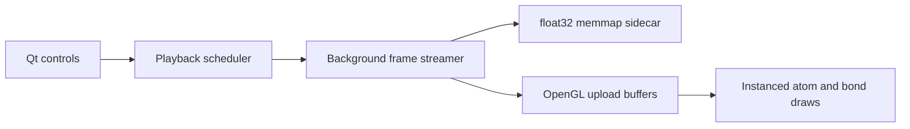

# TrajPlayer

[](https://github.com/luosj1212/TrajPlayer/actions/workflows/ci.yml)
[](LICENSE)
[](#requirements)

A GPU-first desktop viewer for responsive playback and scrubbing of large
molecular dynamics trajectories.


TrajPlayer focuses on one job: opening local ASE and Gromacs trajectories
quickly and playing them smoothly with bounded memory use. It is a lightweight
viewer, not a replacement for the analysis pipelines in OVITO, VMD, or VIAMD.

> **Alpha release:** file compatibility and cache metadata may still change.
> Keep the original trajectory files.

## Why TrajPlayer

TrajPlayer began with a practical frustration from machine-learning potential
development. ASE `.traj` files fit naturally into simulation and training
workflows, but quickly inspecting a long trajectory, moving to a distant frame,
or scrubbing through it interactively was often less convenient than producing
the trajectory in the first place.

The first working prototype was built with the assistance of OpenAI Codex. It
was then iteratively profiled, tested, and reworked around a narrow goal: open an
ASE trajectory directly, show the first useful frame quickly, and keep playback
responsive without loading the whole trajectory into RAM.

Gromacs became another frequent part of the same workflow, so support was
extended to GRO structures and XTC/TRR trajectories. The project remains
deliberately focused on fast local inspection rather than reproducing the broad
analysis and publication-rendering features of established molecular tools.

## Highlights

- OpenGL instanced atoms and bonds with no per-atom CPU drawing loop
- Contiguous `(T, N, 3)` float32 sidecar data backed by `numpy.memmap`
- Background streaming, direction-aware prefetch, and a bounded 256 MiB frame cache
- Target-first random access while uncached trajectories fill progressively
- Live slider scrubbing without waiting for mouse release
- Sequential 1-60 FPS playback with no trajectory-frame skipping
- Ball-stick, Ball, and Bond representations with adjustable radii
- Periodic box display and connected-chain or individual-atom isolation
- Portable Windows x64 and Linux x86_64 packages

## Downloads

Prebuilt packages are attached to the
[GitHub Releases](https://github.com/luosj1212/TrajPlayer/releases) page.

1. Download the archive for your operating system.
2. Extract the complete `TrajPlayer` directory.
3. Run `TrajPlayer.exe` on Windows or `./TrajPlayer/TrajPlayer` on Linux.

Keep the `_internal` directory beside the executable. The application will not
start if only the executable is copied out of its directory.

## Supported Files

| Input | Support | Access strategy |
| --- | --- | --- |
| ASE `.traj` | Trajectory | Native target-first reads plus sidecar cache |
| `.xyz`, `.extxyz` | Trajectory | Reusable byte-offset index plus sidecar cache |
| Gromacs `.xtc`, `.trr` | Trajectory | Pair with a `.gro` topology; native target-first reads |
| `.gro` | Structure/topology | Open alone or together with XTC/TRR |
| `.pdb`, `.cif` | Structure | Read through ASE |

For XTC/TRR, select or drop the trajectory and GRO file together. Opening the
trajectory alone also works when a same-named GRO file is beside it.

## Alternatives and Scope

There are several good ways to inspect ASE trajectories. TrajPlayer is intended
to complement them, not hide their existence.

| Tool | ASE `.traj` workflow | Best suited for |
| --- | --- | --- |
| [ASE GUI](https://ase-lib.org/ase/gui/gui.html) | Direct: `ase gui md.traj` | Small or medium trajectories, ASE-native properties, plots, and basic measurements |
| [ZnDraw](https://zndraw.readthedocs.io/) | Direct through ASE I/O | Browser-based viewing, remote access, editing, and collaboration |
| [NGLView](https://nglviewer.org/nglview/) | Direct from an ASE `Trajectory` in Python | Jupyter notebooks and interactive molecular representations |
| [OVITO Pro](https://www.ovito.org/manual/reference/file_formats/input/ase_trajectory.html) | Direct ASE trajectory reader | Rich analysis pipelines, selections, modifiers, and rendering |
| OVITO Basic, VMD, and similar tools | Convert first, commonly to extXYZ | Mature analysis or specialized visualization after conversion |
| **TrajPlayer** | Direct drag-and-drop | Large local trajectories, fast startup, live scrubbing, and bounded memory use |

Conversion remains a perfectly valid option:

```bash
ase convert md.traj md.extxyz
```

For multi-gigabyte trajectories, however, conversion adds waiting time, creates
another large file, and may not preserve every calculator-specific property.
TrajPlayer targets that gap: a native desktop viewer that needs neither a
notebook, a format-conversion step, nor an OVITO Pro license for direct `.traj`
playback.

## Run From Source

### Windows

```powershell
git clone https://github.com/luosj1212/TrajPlayer.git
cd TrajPlayer
py -3.11 -m venv .venv
.venv\Scripts\Activate.ps1
python -m pip install --upgrade pip
python -m pip install -e .
python -m trajplayer
```

After installing the environment, `run_app.bat` can also launch the app.

### Linux

```bash
git clone https://github.com/luosj1212/TrajPlayer.git
cd TrajPlayer
python3 -m venv .venv
source .venv/bin/activate
python -m pip install --upgrade pip
python -m pip install -e .
python -m trajplayer
```

Try the included sample with:

```bash
python -m trajplayer examples/c60.extxyz
```

## Architecture



The UI thread schedules work and submits ready GPU buffers. Trajectory I/O,
indexing, cache population, and filter-buffer preparation remain off the UI
thread. A sidecar cache grows on disk as frames are requested, while the RAM
window remains bounded independently of total trajectory length.

## Reference Performance

One local synthetic benchmark on an NVIDIA GeForce RTX 4070 Laptop GPU,
OpenGL 3.3, with GPU completion timing enabled produced:

| Scene | Cadence | Paint | Position upload | Paint + upload |
| --- | ---: | ---: | ---: | ---: |
| 100,000 atoms + 99,999 bonds | 59.8 FPS | 2.56 ms avg | 0.43 ms avg | 2.98 ms avg |

This is a reference result, not a hardware-independent guarantee. Display
refresh, GPU driver, bond count, window size, and cache state all affect the
observed cadence.

Run the built-in synthetic benchmark with:

```bash
python app.py --benchmark-output=benchmark.json --benchmark-atoms=100000 \
  --benchmark-frames=64 --benchmark-render-frames=120 \
  --benchmark-bonds --benchmark-finish-gpu
```

Generated benchmark stores and reports are ignored by Git.

## Requirements

- Python 3.10 or 3.11 when running from source
- OpenGL 3.3 capable GPU and current graphics driver
- Windows 10/11 x64, or Linux x86_64 with Qt XCB runtime libraries

On Ubuntu, missing Qt runtime libraries can usually be installed with:

```bash
sudo apt-get install libegl1 libgl1 libxkbcommon-x11-0 libxcb-cursor0 \
  libxcb-icccm4 libxcb-image0 libxcb-keysyms1 libxcb-randr0 \
  libxcb-render-util0 libxcb-shape0 libxcb-xinerama0
```

## Known Limitations

- No macOS package yet
- No ribbon, molecular surface, volume, label, or publication renderer
- No built-in RMSD/RMSF analysis, measurements, scripting API, or video export
- XTC/TRR requires a compatible GRO topology
- The sidecar cache consumes additional disk space and is invalidated when its source changes

## Development

```bash
python -m pip install -e ".[dev]"
python -m pytest -q
python scripts/check_release.py
```

Regenerate the README screenshot after UI changes with:

```bash
python scripts/capture_readme.py examples/c60.extxyz docs/images/trajplayer.png
```

See [CONTRIBUTING.md](CONTRIBUTING.md) for contribution guidelines and
[SECURITY.md](SECURITY.md) for private vulnerability reporting.

## License

TrajPlayer source code is released under the [MIT License](LICENSE). Packaged
builds include separately licensed dependencies; see
[THIRD_PARTY_NOTICES.md](THIRD_PARTY_NOTICES.md).
